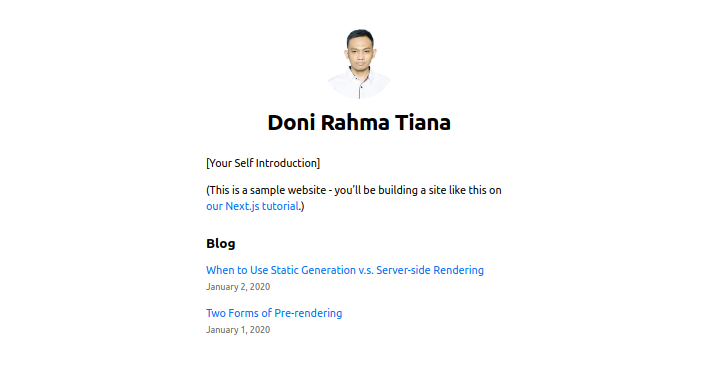
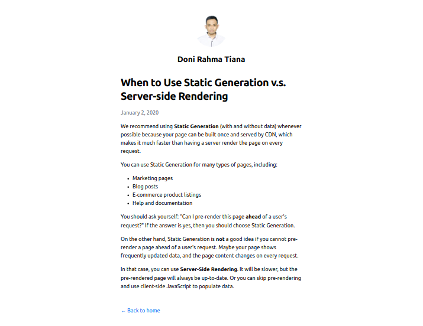

# Next.js App

Next.js app deployment.

## Demo

[https://nextjs-blog-three-orpin-70.vercel.app/](https://nextjs-blog-three-orpin-70.vercel.app/)

## User Interfaces

## How to run

> 1. install Node.js
> 2. clone this repository
> 3. execute `npm install`
> 4. execute `npm audit fix`
> 5. execute `npm run build`
> 6. execute `npm start`
> 7. now server application is running on http://localhost:3000

## Deployment

Follow deployment guide [here](https://nextjs.org/learn/basics/deploying-nextjs-app/github)
